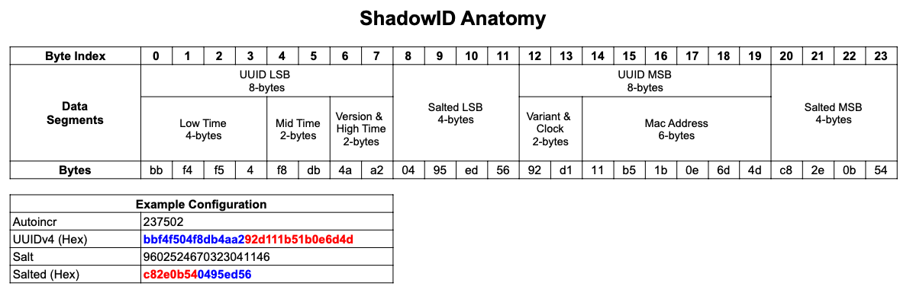

# ShadowID 

Please read the article on my blog: [ShadowID: How to Expose the Auto-Increment ID to the Public Without Compromising Security](https://josestg.com/posts/golang/shadowid-expose-the-auto-increment-id-to-public-without-compromising-security/).
